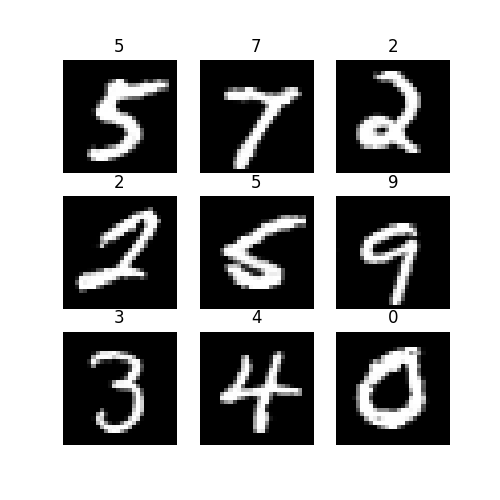
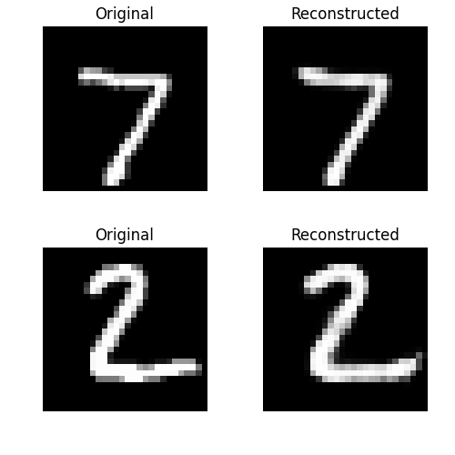
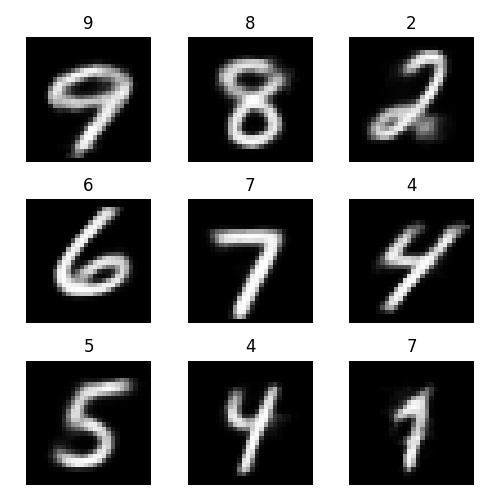

# Generative Models
This repository contains the implementation of various generative models, e.g., GANs, VAEs, Transformers, Diffusion Models, etc.

## GANs
GANs folder contains the implementation of various GANs, e.g., `DCGAN`, `cGAN`, `AcGAN`, `LS-GAN` etc. 
 `src` folder contains the implementation of the GANs, and `notebooks` folder contains the notebooks used to train and test the models.
 
 ### Implementations
- [Conditional DCGAN (cDCGAN)](models/GANs/src/cDCGAN.py) | [Notebook](models/GANs/notebooks/cDCGAN.ipynb)
- [Auxiliary Classifier GAN (ACGAN)](models/GANs/src/AcGAN.py)
- [Conditional GAN (cGAN)](models/GANs/src/cGAN.py) | [Notebook](models/GANs/notebooks/cGAN.ipynb)
- [Vanilla GAN](models/GANs/src/GAN.py) | [Notebook](models/GANs/notebooks/GAN.ipynb)
- [Least Squares GAN (LS-GAN)](models/GANs/src/LS_GAN.py)
- [VAE-GAN](models/GANs/src/VAE_GAN.py) | [Notebook](models/GANs/notebooks/VAE_GAN.ipynb)

 ### Results
 Here are some of the results of the GANs implemented in this repository:
- **Conditional DCGAN**

    The title shows the label of the generated image, and the image is the generated image.

    


## AE_VAEs
`AE_VAEs` folder contains the implementation of various `Autoencoders` and `Variational Autoencoders`.
    `src` folder contains the implementation of the models, and `notebooks` folder contains the notebooks used to train and test the models.

### Implementations
- [Autoencoder](models/AE_VAEs/src/AE.py) | [Notebook](models/AE_VAEs/notebooks/AE.ipynb)
- [Denoising Autoencoder (DAE)](models/AE_VAEs/src/denoising_AE.py) | [Notebook](models/AE_VAEs/notebooks/denoising_AE.ipynb)
- [Variational Autoencoder (VAE)](models/AE_VAEs/src/VAE.py) | [Notebook](models/AE_VAEs/notebooks/VAE.ipynb)
- [Conditional Variational Autoencoder (cVAE)](models/AE_VAEs/src/cVAE.py)
 | [Notebook](models/AE_VAEs/notebooks/cVAE.ipynb)


### Results
Here are some of the results of the `AE_VAEs` implemented in this repository:

- **Autoencoder**

    The image shows the original and the reconstructed digit
    from the MNIST dataset.

    


- **Conditional VAE**

    The image titile shows the label of the generated image, and the image is the generated image.

    

## References
- `Understanding AE&VAE: `
    - https://www.jeremyjordan.me/variational-autoencoders/
    - https://www.jeremyjordan.me/autoencoders/
    - https://www.simplilearn.com/tutorials/deep-learning-tutorial/what-are-autoencoders-in-deep-learning
- `Understanding GANs: `
    - https://developers.google.com/machine-learning/gan/gan_structure
    - https://neptune.ai/blog/6-gan-architectures
- `Understanding Transformers: ` 
    - https://cgarbin.github.io/understanding-transformers-in-one-morning/
    - https://e2eml.school/transformers.html
- `Understanding Diffusion Models: `
    - https://encord.com/blog/diffusion-models/#:~:text=Diffusion%20models%20are%20a%20class%20of%20generative%20models%20that%20simulate,a%20sequence%20of%20invertible%20operations
    - https://lilianweng.github.io/posts/2021-07-11-diffusion-models/
    - https://www.assemblyai.com/blog/diffusion-models-for-machine-learning-introduction/


## Requirements
requirements.yml file contains the list of all the required libraries to run the code in this repository.

To install the required libraries, run the following command:
```bash
conda env create -f requirements.yml
```


